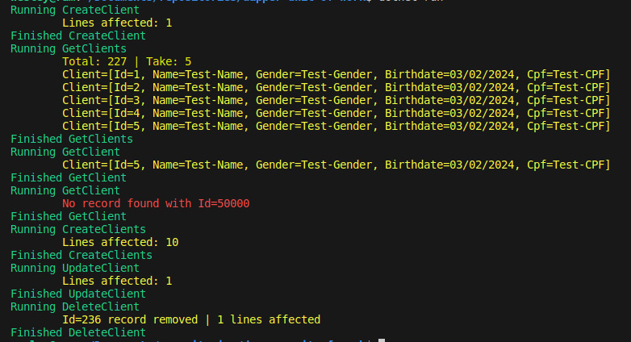

# Dapper Unit of Work e Repository Pattern

Aplicação simples de console usando .NET Core e Dapper para manipulações de transações com banco de dados (CRUD).
O SQLite é utilizado como banco de dados serverless.

As operações que podem alterar o estado do banco de dados (INSERT, UPDATE e DELETE) são manipuladas por transações. Desse modo, caso ocorra qualquer erro durante o processamento da query é possível desfazer as alterações da transação (rollback) e garantir que o banco de dados mantenha-se em um estado consistente.

## Packages utilizados

* Dapper
* Microsoft.Data.SqlClient 
* Microsoft.Data.Sqlite

## Classes

* DbSession: encapsula a criação da conexão com o banco de dados e das transações criadas pela classe UnitOfWork
* UnitOfWork: manipula a criação e commit das transações, através da conexão criada pela classe DbSession
* ClientRepository: manipula a execução das queries para a tabela Client no banco de dados
* Application: contém a implementação das operações CRUD que serão executadas pelo programa

## ClientRepository - CRUD

* Insert: insere um ou mais registros na tabela Client
* Select: recupera um registro pelo Id ou todos os registros da tabela Client
* Update: atualiza os campos de um registro da tabela Client pelo Id
* Delete: remove um registro da tabela Client pelo Id

## Log

